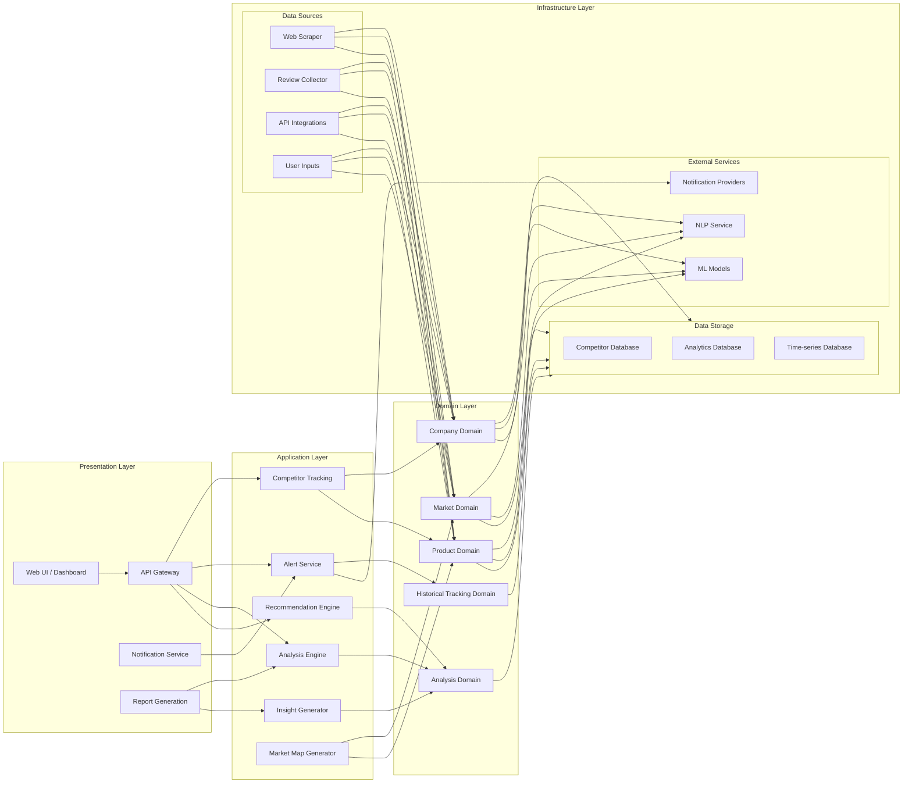

# Sneaky Competitive Intelligence Architecture

```mermaid
graph LR
    %% Presentation Layer
    subgraph PresentationLayer["Presentation Layer"]
        UI["Web UI / Dashboard"]
        API["API Gateway"]
        Notifications["Notification Service"]
        Reports["Report Generation"]
    end

    %% Application Layer
    subgraph ApplicationLayer["Application Layer"]
        CompetitorTracking["Competitor Tracking"]
        AlertService["Alert Service"]
        AnalysisEngine["Analysis Engine"]
        InsightGenerator["Insight Generator"]
        RecommendationEngine["Recommendation Engine"]
        MarketMapGenerator["Market Map Generator"]
    end

    %% Domain Layer
    subgraph DomainLayer["Domain Layer"]
        CompanyDomain["Company Domain"]
        ProductDomain["Product Domain"]
        MarketDomain["Market Domain"]
        AnalysisDomain["Analysis Domain"]
        HistoricalDomain["Historical Tracking Domain"]
    end

    %% Infrastructure Layer
    subgraph InfrastructureLayer["Infrastructure Layer"]
        subgraph DataSources["Data Sources"]
            WebScraper["Web Scraper"]
            ReviewCollector["Review Collector"]
            APIIntegrations["API Integrations"]
            UserInputs["User Inputs"]
        end

        subgraph DataStorage["Data Storage"]
            CompetitorDB["Competitor Database"]
            AnalyticsDB["Analytics Database"]
            TimeseriesDB["Time-series Database"]
        end

        subgraph External["External Services"]
            NLP["NLP Service"]
            MLModels["ML Models"]
            NotificationProviders["Notification Providers"]
        end
    end

    %% Connections between layers
    UI --> API
    API --> CompetitorTracking & AlertService & AnalysisEngine & RecommendationEngine
    Notifications --> AlertService
    Reports --> AnalysisEngine & InsightGenerator

    CompetitorTracking --> CompanyDomain & ProductDomain
    AlertService --> HistoricalDomain
    AnalysisEngine --> AnalysisDomain
    InsightGenerator --> AnalysisDomain
    RecommendationEngine --> AnalysisDomain
    MarketMapGenerator --> MarketDomain & ProductDomain

    CompanyDomain & ProductDomain & MarketDomain & AnalysisDomain & HistoricalDomain --> DataStorage

    WebScraper & ReviewCollector & APIIntegrations & UserInputs --> CompanyDomain & ProductDomain & MarketDomain
    CompanyDomain & ProductDomain & MarketDomain --> NLP & MLModels
    AlertService --> NotificationProviders
```
