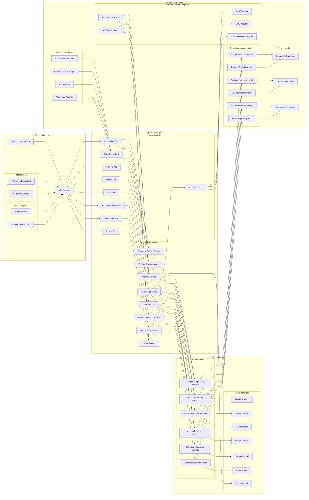

# Sneaky Competitive Intelligence Architecture

```mermaid
graph LR
    %% Presentation Layer
    subgraph PresentationLayer["Presentation Layer"]
        UI["Web UI / Dashboard"]
        APIGateway["API Gateway"]
        subgraph NotificationUI["Notification UI"]
            NotificationDashboard["Notification Dashboard"]
            AlertConfig["Alert Configuration"]
        end
        subgraph ReportingUI["Reporting UI"]
            ReportViewer["Report Viewer"]
            AnalyticsDashboard["Analytics Dashboard"]
        end
    end

    %% Application Layer - Interfaces/Ports
    subgraph ApplicationLayer["Application Layer"]
        subgraph ApplicationPorts["Application Ports"]
            CompetitorPort["Competitor Port"]
            AlertPort["Alert Port"]
            AnalysisPort["Analysis Port"]
            InsightPort["Insight Port"]
            RecommendationPort["Recommendation Port"]
            MarketMapPort["Market Map Port"]
            NotificationPort["Notification Port"]
            ReportPort["Report Port"]
            DataSourcePort["Data Source Port"]
        end

        subgraph ApplicationServices["Application Services"]
            CompanyTracker["Company Tracker Service"]
            ProductTracker["Product Tracker Service"]
            AlertService["Alert Service"]
            AnalysisService["Analysis Service"]
            ReportingService["Reporting Service"]
            InsightService["Insight Service"]
            RecommendationService["Recommendation Service"]
            MarketMapService["Market Map Service"]
        end
    end

    %% Domain Layer
    subgraph DomainLayer["Domain Layer"]
        subgraph DomainModels["Domain Models"]
            CompanyModel["Company Model"]
            ProductModel["Product Model"]
            MarketModel["Market Model"]
            AnalysisModel["Analysis Model"]
            HistoricalModel["Historical Model"]
            EventModel["Event Model"]
            InsightModel["Insight Model"]
        end

        subgraph DomainInterfaces["Domain Interfaces"]
            CompanyRepository["Company Repository Interface"]
            ProductRepository["Product Repository Interface"]
            MarketRepository["Market Repository Interface"]
            AnalysisRepository["Analysis Repository Interface"]
            HistoricalRepository["Historical Repository Interface"]
            EventRepository["Event Repository Interface"]
        end
    end

    %% Infrastructure Layer
    subgraph InfrastructureLayer["Infrastructure Layer"]
        subgraph DataSources["Data Source Adapters"]
            WebScraperAdapter["Web Scraper Adapter"]
            ReviewCollectorAdapter["Review Collector Adapter"]
            APIAdapter["API Adapter"]
            UserInputAdapter["User Input Adapter"]
        end

        subgraph Repositories["Repository Implementations"]
            CompanyRepoImpl["Company Repository Impl"]
            ProductRepoImpl["Product Repository Impl"]
            MarketRepoImpl["Market Repository Impl"]
            AnalysisRepoImpl["Analysis Repository Impl"]
            HistoricalRepoImpl["Historical Repository Impl"]
            EventRepoImpl["Event Repository Impl"]
        end

        subgraph ExternalServices["External Service Adapters"]
            NLPAdapter["NLP Service Adapter"]
            MLAdapter["ML Service Adapter"]
            EmailAdapter["Email Adapter"]
            SMSAdapter["SMS Adapter"]
            PushAdapter["Push Notification Adapter"]
        end

        subgraph Persistence["Persistence Layer"]
            CompetitorDB["Competitor Database"]
            AnalyticsDB["Analytics Database"]
            TimeseriesDB["Time-series Database"]
        end
    end

    %% Clean Architecture Connections

    %% UI to API Gateway
    UI --> APIGateway
    NotificationDashboard & AlertConfig --> APIGateway
    ReportViewer & AnalyticsDashboard --> APIGateway

    %% API Gateway to Application Ports
    APIGateway --> CompetitorPort & AlertPort & AnalysisPort & InsightPort & RecommendationPort & MarketMapPort & ReportPort

    %% Application Services implement Ports
    CompetitorPort --> CompanyTracker & ProductTracker
    AlertPort --> AlertService
    AnalysisPort --> AnalysisService
    InsightPort --> InsightService
    RecommendationPort --> RecommendationService
    MarketMapPort --> MarketMapService
    ReportPort --> ReportingService

    %% Application Services depend on Domain Interfaces (DIP)
    CompanyTracker --> CompanyRepository
    ProductTracker --> ProductRepository
    AlertService --> EventRepository & NotificationPort
    AnalysisService --> AnalysisRepository & CompanyRepository & ProductRepository
    InsightService --> AnalysisRepository & HistoricalRepository
    RecommendationService --> AnalysisRepository & CompanyRepository & MarketRepository
    MarketMapService --> MarketRepository & ProductRepository
    ReportingService --> AnalysisRepository & InsightModel

    %% Domain Models used by Domain Interfaces
    CompanyRepository --> CompanyModel
    ProductRepository --> ProductModel
    MarketRepository --> MarketModel
    AnalysisRepository --> AnalysisModel
    HistoricalRepository --> HistoricalModel
    EventRepository --> EventModel

    %% Infrastructure implements Domain Interfaces (DIP)
    CompanyRepository --> CompanyRepoImpl
    ProductRepository --> ProductRepoImpl
    MarketRepository --> MarketRepoImpl
    AnalysisRepository --> AnalysisRepoImpl
    HistoricalRepository --> HistoricalRepoImpl
    EventRepository --> EventRepoImpl

    %% Infrastructure connects to persistence
    CompanyRepoImpl & ProductRepoImpl --> CompetitorDB
    AnalysisRepoImpl & MarketRepoImpl --> AnalyticsDB
    HistoricalRepoImpl & EventRepoImpl --> TimeseriesDB

    %% Data Sources connect to Infrastructure
    WebScraperAdapter & ReviewCollectorAdapter & APIAdapter & UserInputAdapter --> DataSourcePort
    DataSourcePort --> CompanyTracker & ProductTracker

    %% External Services connect through adapters
    NLPAdapter & MLAdapter --> AnalysisService & InsightService
    NotificationPort --> EmailAdapter & SMSAdapter & PushAdapter
```
