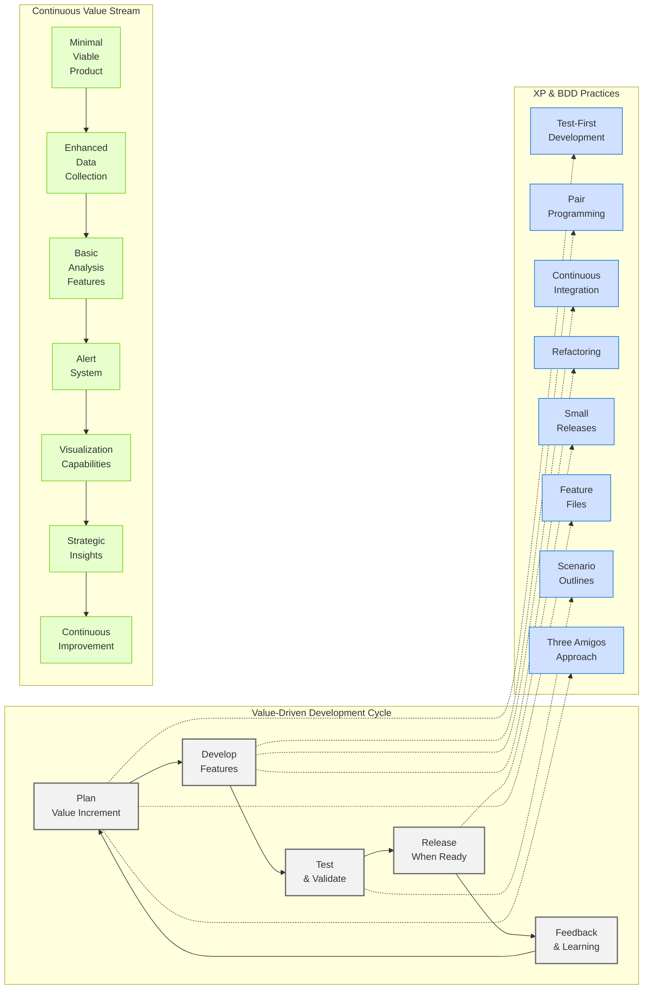

# Development Flow

```mermaid
graph LR
    subgraph "Value-Driven Development Cycle"
        direction LR
        P[Plan<br/>Value Increment] --> D[Develop<br/>Features]
        D --> T[Test<br/>& Validate]
        T --> R[Release<br/>When Ready]
        R --> F[Feedback<br/>& Learning]
        F --> P
    end

    subgraph "Continuous Value Stream"
        V1[Minimal<br/>Viable<br/>Product] --> V2[Enhanced<br/>Data<br/>Collection]
        V2 --> V3[Basic<br/>Analysis<br/>Features]
        V3 --> V4[Alert<br/>System]
        V4 --> V5[Visualization<br/>Capabilities]
        V5 --> V6[Strategic<br/>Insights]
        V6 --> V7[Continuous<br/>Improvement]
    end

    subgraph "XP & BDD Practices"
        XP1[Test-First<br/>Development]
        XP2[Pair<br/>Programming]
        XP3[Continuous<br/>Integration]
        XP4[Refactoring]
        XP5[Small<br/>Releases]

        BDD1[Feature<br/>Files]
        BDD2[Scenario<br/>Outlines]
        BDD3[Three Amigos<br/>Approach]
    end

    P -.-> XP1 & BDD1 & BDD3
    D -.-> XP2 & XP3 & XP4
    T -.-> BDD2
    R -.-> XP5

    classDef cycle fill:#f2f2f2,stroke:#666,stroke-width:2px
    classDef value fill:#e6ffcc,stroke:#66cc00
    classDef practice fill:#d0e0ff,stroke:#0066cc

    class P,D,T,R,F cycle
    class V1,V2,V3,V4,V5,V6,V7 value
    class XP1,XP2,XP3,XP4,XP5,BDD1,BDD2,BDD3 practice
```
