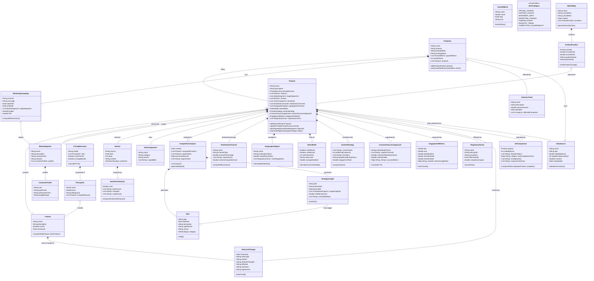

# Sneaky Competitive Intelligence Domain Model

```mermaid
classDiagram
class Company {
+String name
+String industry
+String foundedDate
+String fundingStatus
+List~GrowthMetric~ growthMetrics
+int marketShare
+List~Product~ products
+addProduct(Product product)
+trackGrowthMetric(GrowthMetric metric)
}

    class Product {
        +String name
        +String description
        +PricingStructure pricingStructure
        +List~Feature~ features
        +List~MarketSegment~ targetSegments
        +List~Review~ reviews
        +List~TechComponent~ techStack
        +List~DistributionChannel~ distributionChannels
        +List~GeographicRegion~ geographicPresence
        +SalesModel salesModel
        +ContentStrategy contentStrategy
        +CustomerSuccessApproach customerSuccessApproach
        +EngagementMetrics engagementMetrics
        +List~RegulatoryFactor~ regulatoryFactors
        +addFeature(Feature feature)
        +updatePricing(PricingStructure pricing)
        +addTargetSegment(MarketSegment segment)
        +expandToRegion(GeographicRegion region)
    }

    class Feature {
        +String name
        +String description
        +boolean isCore
        +Date introduced
        +compareWith(Feature otherFeature)
    }

    class PricingStructure {
        +String model
        +List~PricingTier~ tiers
        +boolean hasFreeTier
        +boolean isUsageBased
        +calculateTCO()
    }

    class PricingTier {
        +String name
        +double price
        +String billingCycle
        +List~Feature~ includedFeatures
    }

    class MarketSegment {
        +String name
        +String description
        +String customerSize
        +String industry
        +List~CustomerProfile~ profiles
    }

    class CustomerProfile {
        +String role
        +String painPoints
        +String decisionFactors
        +String budgetRange
    }

    class Review {
        +String source
        +Date date
        +int rating
        +String content
        +SentimentAnalysis sentiment
    }

    class SentimentAnalysis {
        +double score
        +List~String~ keyPhrases
        +List~String~ strengths
        +List~String~ weaknesses
        +analyzeSentiment(String text)
    }

    class MarketingCampaign {
        +String channel
        +String message
        +Date startDate
        +Date endDate
        +List~MarketSegment~ targetSegments
        +double budget
        +double ROI
        +analyzeEffectiveness()
    }

    class TechComponent {
        +String name
        +String category
        +String version
        +List~String~ capabilities
    }

    class IndustryTrend {
        +String name
        +String description
        +double relevanceScore
        +Date identified
        +List~Company~ affectedCompanies
    }

    class GrowthMetric {
        +String name
        +double value
        +Date date
        +String unit
        +trackHistory()
    }

    class CompetitiveAnalysis {
        +Date created
        +List~Product~ comparedProducts
        +List~Feature~ gapAnalysis
        +Map benchmarkScores
        +List~String~ opportunities
        +runAnalysis()
        +generateReport()
    }

    class Alert {
        +String type
        +Date detected
        +String description
        +String significance
        +String source
        +AlertCategory category
        +notify()
    }

    class AlertCategory {
        <<enumeration>>
        PRICING_CHANGE
        FEATURE_LAUNCH
        SENTIMENT_SHIFT
        MARKETING_CHANGE
        FUNDING_EVENT
        INDUSTRY_TREND
        COMPETITIVE_VULNERABILITY
    }

    Company "1" *-- "*" Product: offers
    Product "1" *-- "*" Feature: contains
    Product "1" *-- "1" PricingStructure: priced with
    PricingStructure "1" *-- "*" PricingTier: composed of
    PricingTier "*" o-- "*" Feature: includes
    Product "*" o-- "*" MarketSegment: targets
    MarketSegment "1" *-- "*" CustomerProfile: profiles
    Product "1" *-- "*" Review: receives
    Review "1" *-- "1" SentimentAnalysis: analyzed by
    Company "1" *-- "*" MarketingCampaign: runs
    MarketingCampaign "*" o-- "*" MarketSegment: targets
    Product "1" *-- "*" TechComponent: uses
    Company "*" o-- "*" IndustryTrend: affected by
    class DistributionChannel {
        +String name
        +String channelType
        +double revenuePercentage
        +List~String~ requirements
        +double customerAcquisitionCost
        +analyzeEffectiveness()
    }

    class GeographicRegion {
        +String name
        +String localizationStatus
        +double marketPenetration
        +List~RegulatoryFactor~ localRegulations
        +calculateMarketSize()
    }

    class SalesModel {
        +boolean isSelfServe
        +boolean isSalesLed
        +int salesTeamSize
        +String salesCycle
        +double averageDealSize
        +calculateConversionRate()
    }

    class ContentStrategy {
        +List~String~ contentTypes
        +int publishingFrequency
        +List~String~ keyTopics
        +String thoughtLeadershipFocus
        +double engagementRate
        +analyzeImpact()
    }

    class CustomerSuccessApproach {
        +String onboardingProcess
        +List~String~ supportChannels
        +double customerSatisfactionScore
        +double retentionRate
        +Map~String, String~ successMetrics
        +calculateLTV()
    }

    class EngagementMetrics {
        +double dau
        +double mau
        +double dauMauRatio
        +double activationRate
        +double retentionRate
        +Map~String, Double~ featureUsageStats
        +trackTrends()
    }

    class RegulatoryFactor {
        +String name
        +String description
        +String jurisdiction
        +Date effectiveDate
        +double complianceImpact
        +assessRisk()
    }

    Product "*" --o "1" CompetitiveAnalysis: analyzed in
    CompetitiveAnalysis "1" *-- "*" Alert: generates
    Product "1" *-- "*" DistributionChannel: distributed through
    Product "1" *-- "*" GeographicRegion: available in
    Product "1" *-- "1" SalesModel: sold via
    Product "1" *-- "1" ContentStrategy: marketed with
    Product "1" *-- "1" CustomerSuccessApproach: supported by
    Product "1" *-- "1" EngagementMetrics: measured by
    Product "*" o-- "*" RegulatoryFactor: affected by
    class HistoricalChange {
        +Date timestamp
        +String entityType
        +String entityId
        +String attributeChanged
        +String oldValue
        +String newValue
        +String significance
        +trackTrend()
    }

    class MarketMap {
        +String name
        +String xAxisMetric
        +String yAxisMetric
        +Date created
        +List~ProductPosition~ positions
        +generateVisualization()
    }

    class ProductPosition {
        +Product product
        +double xCoordinate
        +double yCoordinate
        +String quadrantName
        +Date positionDate
        +trackPositionChange()
    }

    class DataSource {
        +String name
        +String type
        +double reliabilityScore
        +int updateFrequencyDays
        +boolean isActive
        +Date lastUpdated
        +validateConnection()
    }

    class StrategicInsight {
        +String title
        +String description
        +Date generated
        +List~CompetitiveAnalysis~ supportingData
        +double confidenceScore
        +List~String~ actionableSteps
        +prioritize()
    }

    class UXComparison {
        +Product product
        +int usabilityScore
        +List~String~ designPatterns
        +Map~String, Integer~ taskCompletionTimes
        +List~String~ strengthAreas
        +List~String~ improvementAreas
        +compareWithCompetitor(Product competitor)
    }

    Product "1" *-- "*" HistoricalChange: tracked by
    MarketMap "1" *-- "*" ProductPosition: contains
    ProductPosition "1" o-- "1" Product: represents
    Company "*" --o "*" DataSource: uses
    CompetitiveAnalysis "1" *-- "*" StrategicInsight: generates
    Product "1" *-- "1" UXComparison: evaluated by
    StrategicInsight "*" --o "*" Alert: may trigger
    Feature "1" *-- "*" HistoricalChange: tracks changes in
    Product "*" o-- "*" DataSource: data collected from
```
