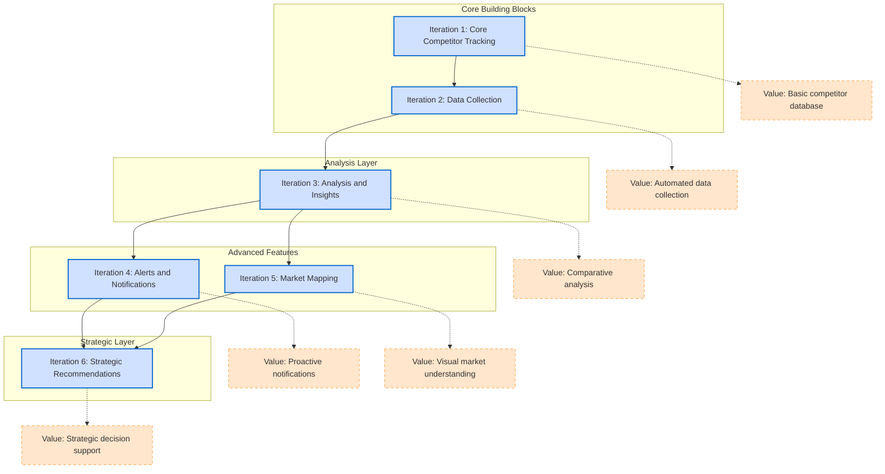

# Iteration Flow

```mermaid
flowchart TD
    S1[Iteration 1: Core Competitor Tracking]
    S2[Iteration 2: Data Collection]
    S3[Iteration 3: Analysis and Insights]
    S4[Iteration 4: Alerts and Notifications]
    S5[Iteration 5: Market Mapping]
    S6[Iteration 6: Strategic Recommendations]

    S1 --> S2
    S2 --> S3
    S3 --> S4 & S5
    S4 & S5 --> S6

    subgraph "Core Building Blocks"
        S1
        S2
    end

    subgraph "Analysis Layer"
        S3
    end

    subgraph "Advanced Features"
        S4
        S5
    end

    subgraph "Strategic Layer"
        S6
    end

    V1[Value: Basic competitor database]
    V2[Value: Automated data collection]
    V3[Value: Comparative analysis]
    V4[Value: Proactive notifications]
    V5[Value: Visual market understanding]
    V6[Value: Strategic decision support]

    S1 -.-> V1
    S2 -.-> V2
    S3 -.-> V3
    S4 -.-> V4
    S5 -.-> V5
    S6 -.-> V6

    classDef Iteration fill:#d0e0ff,stroke:#0066cc,stroke-width:2px
    classDef value fill:#ffe6cc,stroke:#ff9933,stroke-width:1px,stroke-dasharray: 5 5
    classDef group fill:#f9f9f9,stroke:#999999,stroke-width:1px

    class S1,S2,S3,S4,S5,S6 Iteration
    class V1,V2,V3,V4,V5,V6 value
```
