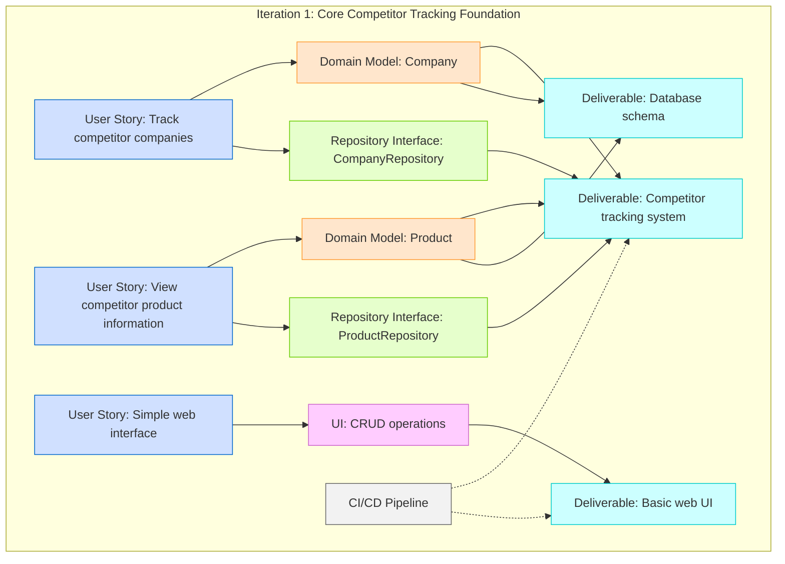

# Iteration 01: Foundational Architecture

```mermaid
flowchart TD
    subgraph Iteration1["Iteration 1: Core Competitor Tracking Foundation"]
        US1[User Story: Track competitor companies]
        US2[User Story: View competitor product information]
        US3[User Story: Simple web interface]

        DM1[Domain Model: Company]
        DM2[Domain Model: Product]

        RI1[Repository Interface: CompanyRepository]
        RI2[Repository Interface: ProductRepository]

        UI1[UI: CRUD operations]
        CI1[CI/CD Pipeline]

        DEL1[Deliverable: Competitor tracking system]
        DEL2[Deliverable: Basic web UI]
        DEL3[Deliverable: Database schema]

        US1 --> DM1
        US1 --> RI1
        US2 --> DM2
        US2 --> RI2
        US3 --> UI1

        DM1 & DM2 --> DEL1
        RI1 & RI2 --> DEL1
        UI1 --> DEL2
        DM1 & DM2 --> DEL3

        CI1 -.-> DEL1 & DEL2
    end

    classDef userStory fill:#d0e0ff,stroke:#0066cc
    classDef domain fill:#ffe6cc,stroke:#ff9933
    classDef repo fill:#e6ffcc,stroke:#66cc00
    classDef ui fill:#ffccff,stroke:#cc66cc
    classDef deliverable fill:#ccffff,stroke:#00cccc
    classDef infra fill:#f2f2f2,stroke:#666666

    class US1,US2,US3 userStory
    class DM1,DM2 domain
    class RI1,RI2 repo
    class UI1 ui
    class DEL1,DEL2,DEL3 deliverable
    class CI1 infra
```
