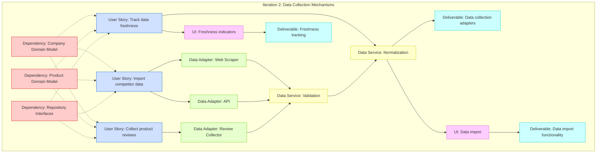

# Iteration 02: Data Collection

```mermaid
flowchart TD
    subgraph Iteration2["Iteration 2: Data Collection Mechanisms"]
        US1[User Story: Import competitor data]
        US2[User Story: Collect product reviews]
        US3[User Story: Track data freshness]

        DEP1[Dependency: Company Domain Model]
        DEP2[Dependency: Product Domain Model]
        DEP3[Dependency: Repository Interfaces]

        DA1[Data Adapter: Web Scraper]
        DA2[Data Adapter: API]
        DA3[Data Adapter: Review Collector]
        DS1[Data Service: Validation]
        DS2[Data Service: Normalization]

        UI1[UI: Data import]
        UI2[UI: Freshness indicators]

        DEL1[Deliverable: Data collection adapters]
        DEL2[Deliverable: Data import functionality]
        DEL3[Deliverable: Freshness tracking]

        DEP1 & DEP2 & DEP3 -.-> US1 & US2 & US3

        US1 --> DA1 & DA2
        US2 --> DA3
        US3 --> DS2

        DA1 & DA2 & DA3 --> DS1
        DS1 --> DS2

        DS2 --> DEL1
        DS2 --> UI1
        US3 --> UI2

        UI1 --> DEL2
        UI2 --> DEL3
    end

    classDef userStory fill:#d0e0ff,stroke:#0066cc
    classDef dependency fill:#ffcccc,stroke:#cc0000
    classDef adapter fill:#e6ffcc,stroke:#66cc00
    classDef service fill:#ffffcc,stroke:#cccc00
    classDef ui fill:#ffccff,stroke:#cc66cc
    classDef deliverable fill:#ccffff,stroke:#00cccc

    class US1,US2,US3 userStory
    class DEP1,DEP2,DEP3 dependency
    class DA1,DA2,DA3 adapter
    class DS1,DS2 service
    class UI1,UI2 ui
    class DEL1,DEL2,DEL3 deliverable
```
