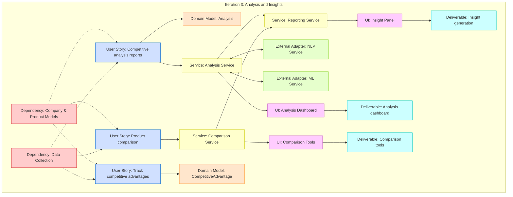

# Iteration 03: Analysis and Insights

```mermaid
flowchart TD
    subgraph Iteration3["Iteration 3: Analysis and Insights"]
        US1[User Story: Competitive analysis reports]
        US2[User Story: Product comparison]
        US3[User Story: Track competitive advantages]

        DEP1[Dependency: Company & Product Models]
        DEP2[Dependency: Data Collection]

        DM1[Domain Model: Analysis]
        DM2[Domain Model: CompetitiveAdvantage]

        SVC1[Service: Analysis Service]
        SVC2[Service: Comparison Service]
        SVC3[Service: Reporting Service]

        ADPT1[External Adapter: NLP Service]
        ADPT2[External Adapter: ML Service]

        UI1[UI: Analysis Dashboard]
        UI2[UI: Comparison Tools]
        UI3[UI: Insight Panel]

        DEL1[Deliverable: Analysis dashboard]
        DEL2[Deliverable: Comparison tools]
        DEL3[Deliverable: Insight generation]

        DEP1 & DEP2 -.-> US1 & US2 & US3

        US1 --> DM1
        US1 --> SVC1
        US2 --> SVC2
        US3 --> DM2

        SVC1 & SVC2 --> SVC3
        SVC1 <--> ADPT1 & ADPT2

        SVC1 --> UI1
        SVC2 --> UI2
        SVC3 --> UI3

        UI1 --> DEL1
        UI2 --> DEL2
        UI3 --> DEL3
    end

    classDef userStory fill:#d0e0ff,stroke:#0066cc
    classDef dependency fill:#ffcccc,stroke:#cc0000
    classDef domain fill:#ffe6cc,stroke:#ff9933
    classDef service fill:#ffffcc,stroke:#cccc00
    classDef adapter fill:#e6ffcc,stroke:#66cc00
    classDef ui fill:#ffccff,stroke:#cc66cc
    classDef deliverable fill:#ccffff,stroke:#00cccc

    class US1,US2,US3 userStory
    class DEP1,DEP2 dependency
    class DM1,DM2 domain
    class SVC1,SVC2,SVC3 service
    class ADPT1,ADPT2 adapter
    class UI1,UI2,UI3 ui
    class DEL1,DEL2,DEL3 deliverable
```
