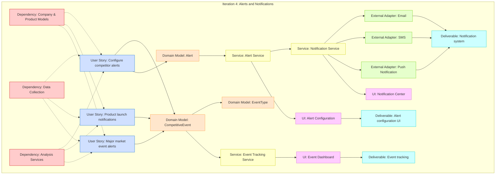

# Iteration 04: Alerts and Notifications

```mermaid
flowchart TD
    subgraph Iteration4["Iteration 4: Alerts and Notifications"]
        US1[User Story: Configure competitor alerts]
        US2[User Story: Product launch notifications]
        US3[User Story: Major market event alerts]

        DEP1[Dependency: Company & Product Models]
        DEP2[Dependency: Data Collection]
        DEP3[Dependency: Analysis Services]

        DM1[Domain Model: CompetitiveEvent]
        DM2[Domain Model: Alert]
        DM3[Domain Model: EventType]

        SVC1[Service: Event Tracking Service]
        SVC2[Service: Alert Service]
        SVC3[Service: Notification Service]

        ADPT1[External Adapter: Email]
        ADPT2[External Adapter: SMS]
        ADPT3[External Adapter: Push Notification]

        UI1[UI: Alert Configuration]
        UI2[UI: Event Dashboard]
        UI3[UI: Notification Center]

        DEL1[Deliverable: Alert configuration UI]
        DEL2[Deliverable: Notification system]
        DEL3[Deliverable: Event tracking]

        DEP1 & DEP2 & DEP3 -.-> US1 & US2 & US3

        US1 & US2 & US3 --> DM1
        US1 --> DM2
        DM1 --> DM3

        DM1 --> SVC1
        DM2 --> SVC2
        SVC2 --> SVC3

        SVC3 --> ADPT1 & ADPT2 & ADPT3

        SVC2 --> UI1
        SVC1 --> UI2
        SVC3 --> UI3

        UI1 --> DEL1
        ADPT1 & ADPT2 & ADPT3 --> DEL2
        UI2 --> DEL3
    end

    classDef userStory fill:#d0e0ff,stroke:#0066cc
    classDef dependency fill:#ffcccc,stroke:#cc0000
    classDef domain fill:#ffe6cc,stroke:#ff9933
    classDef service fill:#ffffcc,stroke:#cccc00
    classDef adapter fill:#e6ffcc,stroke:#66cc00
    classDef ui fill:#ffccff,stroke:#cc66cc
    classDef deliverable fill:#ccffff,stroke:#00cccc

    class US1,US2,US3 userStory
    class DEP1,DEP2,DEP3 dependency
    class DM1,DM2,DM3 domain
    class SVC1,SVC2,SVC3 service
    class ADPT1,ADPT2,ADPT3 adapter
    class UI1,UI2,UI3 ui
    class DEL1,DEL2,DEL3 deliverable
```
