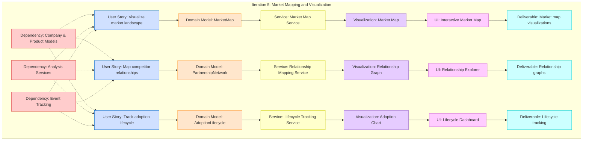

# Iteration 05: Market Mapping

```mermaid
flowchart TD
    subgraph Iteration5["Iteration 5: Market Mapping and Visualization"]
        US1[User Story: Visualize market landscape]
        US2[User Story: Map competitor relationships]
        US3[User Story: Track adoption lifecycle]

        DEP1[Dependency: Company & Product Models]
        DEP2[Dependency: Analysis Services]
        DEP3[Dependency: Event Tracking]

        DM1[Domain Model: MarketMap]
        DM2[Domain Model: PartnershipNetwork]
        DM3[Domain Model: AdoptionLifecycle]

        SVC1[Service: Market Map Service]
        SVC2[Service: Relationship Mapping Service]
        SVC3[Service: Lifecycle Tracking Service]

        VIS1[Visualization: Market Map]
        VIS2[Visualization: Relationship Graph]
        VIS3[Visualization: Adoption Chart]

        UI1[UI: Interactive Market Map]
        UI2[UI: Relationship Explorer]
        UI3[UI: Lifecycle Dashboard]

        DEL1[Deliverable: Market map visualizations]
        DEL2[Deliverable: Relationship graphs]
        DEL3[Deliverable: Lifecycle tracking]

        DEP1 & DEP2 & DEP3 -.-> US1 & US2 & US3

        US1 --> DM1
        US2 --> DM2
        US3 --> DM3

        DM1 --> SVC1
        DM2 --> SVC2
        DM3 --> SVC3

        SVC1 --> VIS1
        SVC2 --> VIS2
        SVC3 --> VIS3

        VIS1 --> UI1
        VIS2 --> UI2
        VIS3 --> UI3

        UI1 --> DEL1
        UI2 --> DEL2
        UI3 --> DEL3
    end

    classDef userStory fill:#d0e0ff,stroke:#0066cc
    classDef dependency fill:#ffcccc,stroke:#cc0000
    classDef domain fill:#ffe6cc,stroke:#ff9933
    classDef service fill:#ffffcc,stroke:#cccc00
    classDef visualization fill:#e6ccff,stroke:#9966cc
    classDef ui fill:#ffccff,stroke:#cc66cc
    classDef deliverable fill:#ccffff,stroke:#00cccc

    class US1,US2,US3 userStory
    class DEP1,DEP2,DEP3 dependency
    class DM1,DM2,DM3 domain
    class SVC1,SVC2,SVC3 service
    class VIS1,VIS2,VIS3 visualization
    class UI1,UI2,UI3 ui
    class DEL1,DEL2,DEL3 deliverable
```
