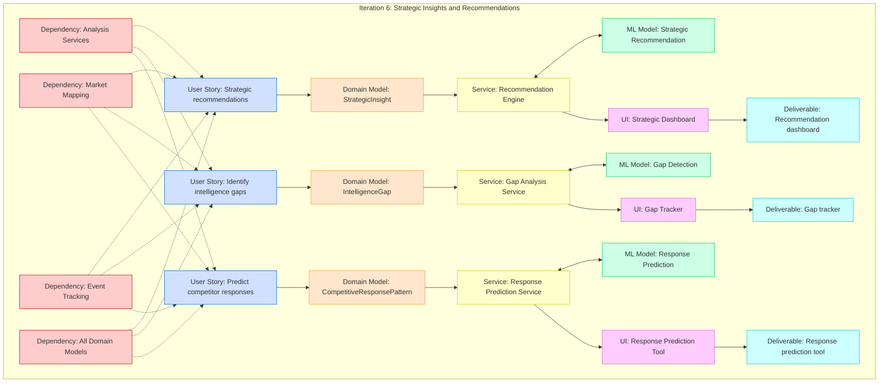

# Iteration 06: Strategy

```mermaid
flowchart TD
    subgraph Iteration6["Iteration 6: Strategic Insights and Recommendations"]
        US1[User Story: Strategic recommendations]
        US2[User Story: Identify intelligence gaps]
        US3[User Story: Predict competitor responses]

        DEP1[Dependency: Analysis Services]
        DEP2[Dependency: Market Mapping]
        DEP3[Dependency: Event Tracking]
        DEP4[Dependency: All Domain Models]

        DM1[Domain Model: StrategicInsight]
        DM2[Domain Model: IntelligenceGap]
        DM3[Domain Model: CompetitiveResponsePattern]

        SVC1[Service: Recommendation Engine]
        SVC2[Service: Gap Analysis Service]
        SVC3[Service: Response Prediction Service]

        ML1[ML Model: Strategic Recommendation]
        ML2[ML Model: Gap Detection]
        ML3[ML Model: Response Prediction]

        UI1[UI: Strategic Dashboard]
        UI2[UI: Gap Tracker]
        UI3[UI: Response Prediction Tool]

        DEL1[Deliverable: Recommendation dashboard]
        DEL2[Deliverable: Gap tracker]
        DEL3[Deliverable: Response prediction tool]

        DEP1 & DEP2 & DEP3 & DEP4 -.-> US1 & US2 & US3

        US1 --> DM1
        US2 --> DM2
        US3 --> DM3

        DM1 --> SVC1
        DM2 --> SVC2
        DM3 --> SVC3

        SVC1 <--> ML1
        SVC2 <--> ML2
        SVC3 <--> ML3

        SVC1 --> UI1
        SVC2 --> UI2
        SVC3 --> UI3

        UI1 --> DEL1
        UI2 --> DEL2
        UI3 --> DEL3
    end

    classDef userStory fill:#d0e0ff,stroke:#0066cc
    classDef dependency fill:#ffcccc,stroke:#cc0000
    classDef domain fill:#ffe6cc,stroke:#ff9933
    classDef service fill:#ffffcc,stroke:#cccc00
    classDef ml fill:#ccffe6,stroke:#00cc66
    classDef ui fill:#ffccff,stroke:#cc66cc
    classDef deliverable fill:#ccffff,stroke:#00cccc

    class US1,US2,US3 userStory
    class DEP1,DEP2,DEP3,DEP4 dependency
    class DM1,DM2,DM3 domain
    class SVC1,SVC2,SVC3 service
    class ML1,ML2,ML3 ml
    class UI1,UI2,UI3 ui
    class DEL1,DEL2,DEL3 deliverable
```
