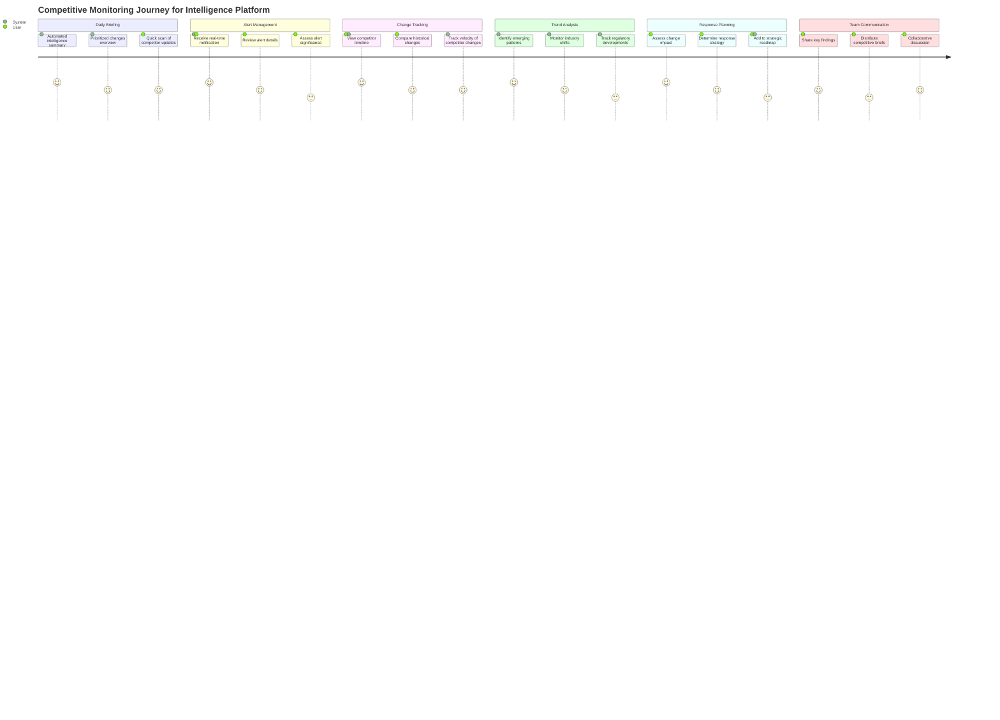

# User Journey for Competitive Monitoring

```mermaid
journey
    title Competitive Monitoring Journey for Intelligence Platform
    section Daily Briefing
        Automated intelligence summary: 5: System
        Prioritized changes overview: 4: System
        Quick scan of competitor updates: 4: User
    section Alert Management
        Receive real-time notification: 5: System, User
        Review alert details: 4: User
        Assess alert significance: 3: User
    section Change Tracking
        View competitor timeline: 5: User, System
        Compare historical changes: 4: User
        Track velocity of competitor changes: 4: System
    section Trend Analysis
        Identify emerging patterns: 5: System
        Monitor industry shifts: 4: System
        Track regulatory developments: 3: System
    section Response Planning
        Assess change impact: 5: User
        Determine response strategy: 4: User
        Add to strategic roadmap: 3: User, System
    section Team Communication
        Share key findings: 4: User
        Distribute competitive briefs: 3: User
        Collaborative discussion: 4: User
```
