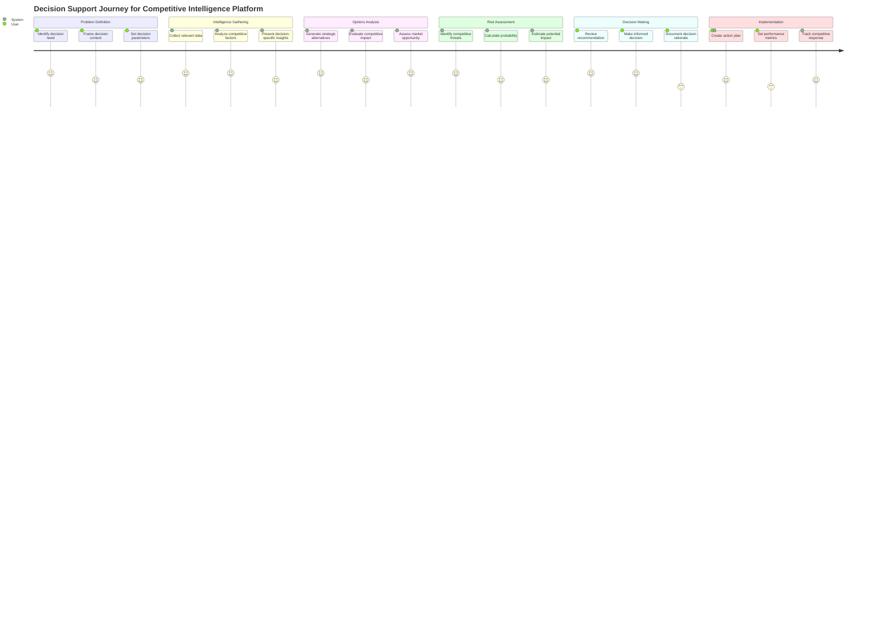

# Decision Support Journey

```mermaid
journey
    title Decision Support Journey for Competitive Intelligence Platform
    section Problem Definition
        Identify decision need: 5: User
        Frame decision context: 4: User
        Set decision parameters: 4: User
    section Intelligence Gathering
        Collect relevant data: 5: System
        Analyze competitive factors: 5: System
        Present decision-specific insights: 4: System
    section Options Analysis
        Generate strategic alternatives: 5: System
        Evaluate competitive impact: 4: System
        Assess market opportunity: 5: System
    section Risk Assessment
        Identify competitive threats: 5: System
        Calculate probability: 4: System
        Estimate potential impact: 4: System
    section Decision Making
        Review recommendation: 5: User
        Make informed decision: 5: User
        Document decision rationale: 3: User
    section Implementation
        Create action plan: 4: User, System
        Set performance metrics: 3: User
        Track competitive response: 4: System
```
