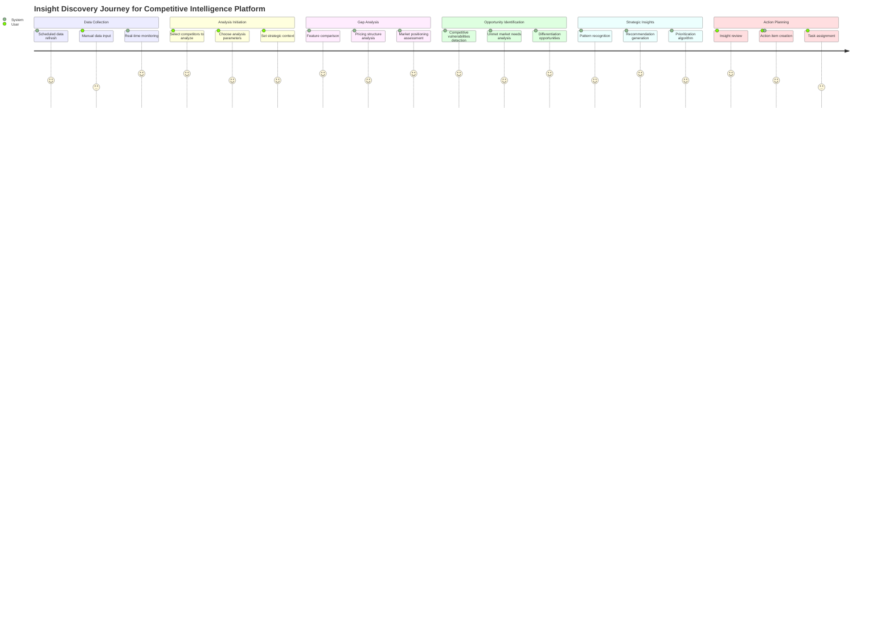

# User Journey for Insight Discovery

```mermaid
journey
    title Insight Discovery Journey for Competitive Intelligence Platform
    section Data Collection
        Scheduled data refresh: 4: System
        Manual data input: 3: User
        Real-time monitoring: 5: System
    section Analysis Initiation
        Select competitors to analyze: 5: User
        Choose analysis parameters: 4: User
        Set strategic context: 4: User
    section Gap Analysis
        Feature comparison: 5: System
        Pricing structure analysis: 4: System
        Market positioning assessment: 5: System
    section Opportunity Identification
        Competitive vulnerabilities detection: 5: System
        Unmet market needs analysis: 4: System
        Differentiation opportunities: 5: System
    section Strategic Insights
        Pattern recognition: 4: System
        Recommendation generation: 5: System
        Prioritization algorithm: 4: System
    section Action Planning
        Insight review: 5: User
        Action item creation: 4: User, System
        Task assignment: 3: User
```
