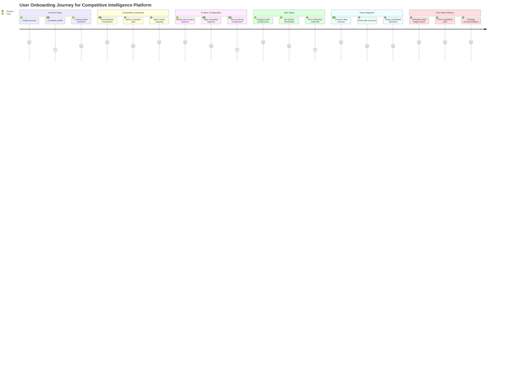

# User Onboarding Journey for Competitive Intelligence Platform

```mermaid
journey
    title User Onboarding Journey for Competitive Intelligence Platform
    section Account Setup
        Create account: 5: User
        Complete profile: 3: User, System
        Connect team members: 4: User
    section Competitive Landscape
        Import/identify competitors: 5: User, System
        Verify competitor data: 4: System
        Initial market mapping: 5: System
    section Product Configuration
        Define own product features: 5: User
        Map competitor features: 4: User, System
        Set up pricing comparison: 3: User, System
    section Alert Setup
        Configure alert preferences: 5: User
        Set priority thresholds: 4: User
        Test notification channels: 3: System
    section Data Integration
        Connect data sources: 5: User, System
        Verify data accuracy: 4: System
        Setup scheduled refreshes: 4: System
    section First Value Delivery
        Generate initial insight report: 5: System
        First competitive alert: 5: System
        Strategy recommendation: 5: System
```
