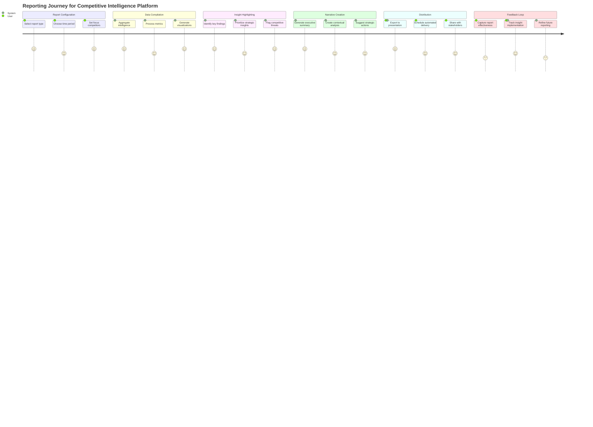

# User Journey for Reporting

```mermaid
journey
    title Reporting Journey for Competitive Intelligence Platform
    section Report Configuration
        Select report type: 5: User
        Choose time period: 4: User
        Set focus competitors: 5: User
    section Data Compilation
        Aggregate intelligence: 5: System
        Process metrics: 4: System
        Generate visualizations: 5: System
    section Insight Highlighting
        Identify key findings: 5: System
        Prioritize strategic insights: 4: System
        Flag competitive threats: 5: System
    section Narrative Creation
        Generate executive summary: 5: System
        Create contextual analysis: 4: System
        Suggest strategic actions: 4: System
    section Distribution
        Export to presentation: 5: User, System
        Schedule automated delivery: 4: User
        Share with stakeholders: 4: User
    section Feedback Loop
        Capture report effectiveness: 3: User
        Track insight implementation: 4: User, System
        Refine future reporting: 3: System
```
