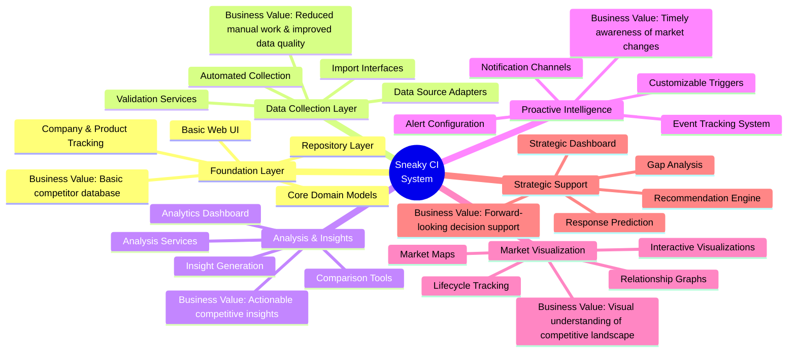
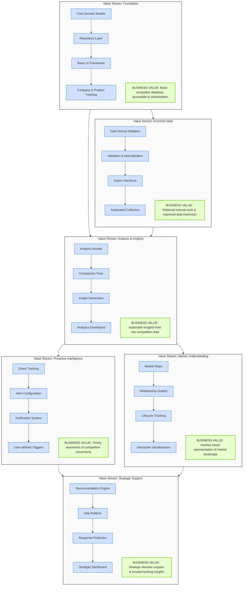

# Value Streams

```mermaid
mindmap
  root((Sneaky CI<br/>System))
    Foundation Layer
      ::icon(fa fa-database)
      Core Domain Models
      Repository Layer
      Basic Web UI
      Company & Product Tracking
      Business Value: Basic competitor database

    Data Collection Layer
      ::icon(fa fa-cloud-download)
      Data Source Adapters
      Validation Services
      Automated Collection
      Import Interfaces
      Business Value: Reduced manual work & improved data quality

    Analysis & Insights
      ::icon(fa fa-chart-line)
      Analysis Services
      Comparison Tools
      Insight Generation
      Analytics Dashboard
      Business Value: Actionable competitive insights

    Proactive Intelligence
      ::icon(fa fa-bell)
      Event Tracking System
      Alert Configuration
      Notification Channels
      Customizable Triggers
      Business Value: Timely awareness of market changes

    Market Visualization
      ::icon(fa fa-project-diagram)
      Market Maps
      Relationship Graphs
      Lifecycle Tracking
      Interactive Visualizations
      Business Value: Visual understanding of competitive landscape

    Strategic Support
      ::icon(fa fa-chess)
      Recommendation Engine
      Gap Analysis
      Response Prediction
      Strategic Dashboard
      Business Value: Forward-looking decision support
```

---

```mermaid
flowchart TD
    subgraph Foundation["Value Stream: Foundation"]
        direction TB
        F1[Core Domain Models]
        F2[Repository Layer]
        F3[Basic UI Framework]
        F4[Company & Product Tracking]

        F1 --> F2 --> F3 --> F4

        F5[BUSINESS VALUE: Basic competitor database accessible to stakeholders]
    end

    subgraph DataCollection["Value Stream: Enriched Data"]
        direction TB
        D1[Data Source Adapters]
        D2[Validation & Normalization]
        D3[Import Interfaces]
        D4[Automated Collection]

        D1 --> D2 --> D3 --> D4

        D5[BUSINESS VALUE: Reduced manual work & improved data freshness]
    end

    subgraph Analysis["Value Stream: Analysis & Insights"]
        direction TB
        A1[Analysis Models]
        A2[Comparison Tools]
        A3[Insight Generation]
        A4[Analytics Dashboard]

        A1 --> A2 --> A3 --> A4

        A5[BUSINESS VALUE: Actionable insights from raw competition data]
    end

    subgraph Alerting["Value Stream: Proactive Intelligence"]
        direction TB
        AL1[Event Tracking]
        AL2[Alert Configuration]
        AL3[Notification System]
        AL4[User-defined Triggers]

        AL1 --> AL2 --> AL3 --> AL4

        AL5[BUSINESS VALUE: Timely awareness of competitive movements]
    end

    subgraph Visualization["Value Stream: Market Understanding"]
        direction TB
        V1[Market Maps]
        V2[Relationship Graphs]
        V3[Lifecycle Tracking]
        V4[Interactive Visualizations]

        V1 --> V2 --> V3 --> V4

        V5[BUSINESS VALUE: Intuitive visual representation of market landscape]
    end

    subgraph Strategy["Value Stream: Strategic Support"]
        direction TB
        S1[Recommendation Engine]
        S2[Gap Analysis]
        S3[Response Prediction]
        S4[Strategic Dashboard]

        S1 --> S2 --> S3 --> S4

        S5[BUSINESS VALUE: Strategic decision support & forward-looking insights]
    end

    Foundation --> DataCollection
    Foundation --> Analysis
    DataCollection --> Analysis
    Analysis --> Alerting
    Analysis --> Visualization
    Alerting & Visualization --> Strategy

    classDef valueStream fill:#f9f9f9,stroke:#666,stroke-width:2px
    classDef businessValue fill:#e6ffcc,stroke:#66cc00,stroke-width:2px
    classDef feature fill:#d0e0ff,stroke:#0066cc

    class Foundation,DataCollection,Analysis,Alerting,Visualization,Strategy valueStream
    class F5,D5,A5,AL5,V5,S5 businessValue
    class F1,F2,F3,F4,D1,D2,D3,D4,A1,A2,A3,A4,AL1,AL2,AL3,AL4,V1,V2,V3,V4,S1,S2,S3,S4 feature
```
